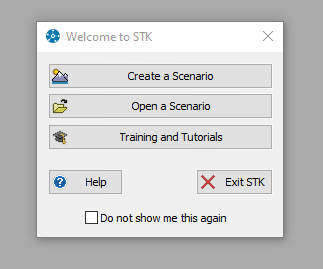
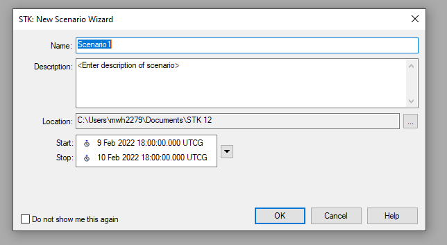
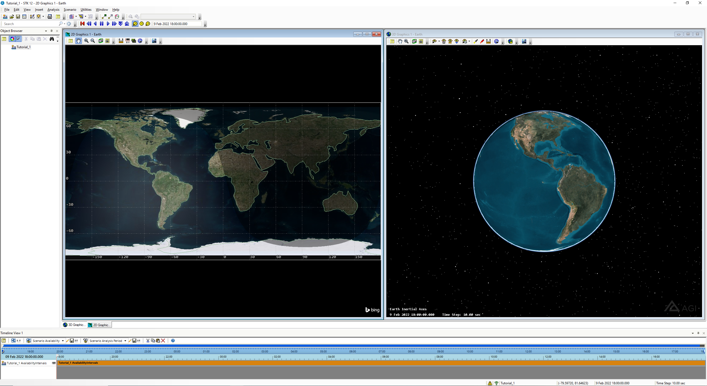

# STK Basics

Upon first opening STK, you should be greeted with a screen that looks something like this:

Assuming that you want to create a new scenario (i.e. a new project), choose the first option:

**Name**: name of the new scenario
**Description**: description of the new scenario
**Location**: directory to save the file, likely best to stick with the default
**Start/Stop**: Time to begin and end the orbit propagation for the scenario. This start/stop time defines how long you want to run the simulation as well as day/night and location of the sun relative to the Earth, etc.

- - - 
**N.B. :** Upon creating the scenario, STK creates a new folder named "Scenario 1" (e.g. for what I have above) in the specified directory. However, it DOES NOT save the new scenario file. You must do this manually after creation.
- - - 
- - -
**N.B. :** Save all scenarios in a different folder. The objects you create (e.g. satellites, facilities, etc.) are each individually saved within the folder. Thus, using separate folders for each scenario prevents overwriting them.
- - - 

After creating the new scenario, you will be brought to a screen that looks like the following:

Here, I have done "window -> tile vertically" to fill the screen. 

Zooming / panning is pretty straightforward on both of these views. One helpful note: for the 3D model, rotation of the Earth defaults around its center. To instead rotate about a point on the surface of the Earth, use the "magnifying zoom" feature on the top panel of the 3D pane to zoom in on a rectangular section. Afterwards, you then rotate about the center of that section.

Click the "eye with a house" symbol to return to the default view.

SAVE YOUR SCENARIO OFTEN! IT DOES NOT DO SO AUTOMATICALLY

Once you are familiar with the layout of the STK window, you can begin to population your scenario with [objects](STK_Objects.md).

# Customizing STK and Connect Commands
STK provides a number of ways to automate and customize STK.

One way to customize STK is through the use of Connect Commands in the programming API.

To open the programming API, open the html viewer by going to "View -> HTML viewer". Then, click browse on the top menu and navigate to "Example HTML Utilities (on the left) -> STK Automation -> API Demo" and open the API Demo utility, which will dock in the middle of the screen.

These examples provide information on how to automatically add new objects. For a comprehensive list of all Connect Commands, go to "Help -> Programming Interface help"

# Movie Timeline Wizard
STK allows for the straightforward creation of movies to record / export visualizations of your scenario simulation.

Given a saved view (zoom to an [stk object](STK_objects.md) in the 3D viewer, then select "Stored View" in the 3D viewer window menu, click "new", give a descriptive name, then click "OK"), go to "View -> Toolbars -> Movie Timeline".

Click the red "REC" button that appears in the menu at the top of the STK window. Going down the options of the left side of the window, choose the desired format for the video.

- - - 
**N.B. :** In the movie wizard above, under size and quality, it may be helpful to choose "motion blur" to be turned on. Doing so makes the object (e.g. a [satellite](Satellite.md)) appear to travel as fast as it actually is.
- - -

